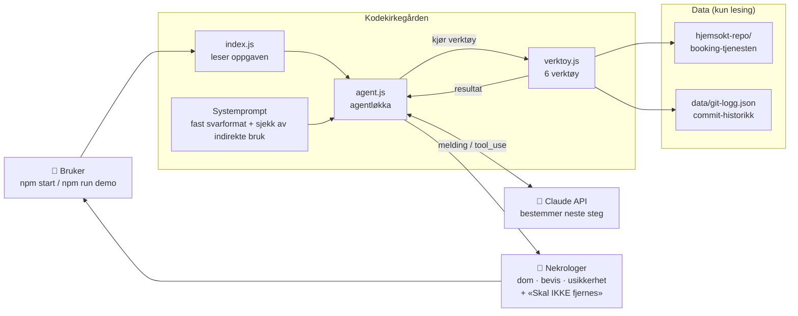
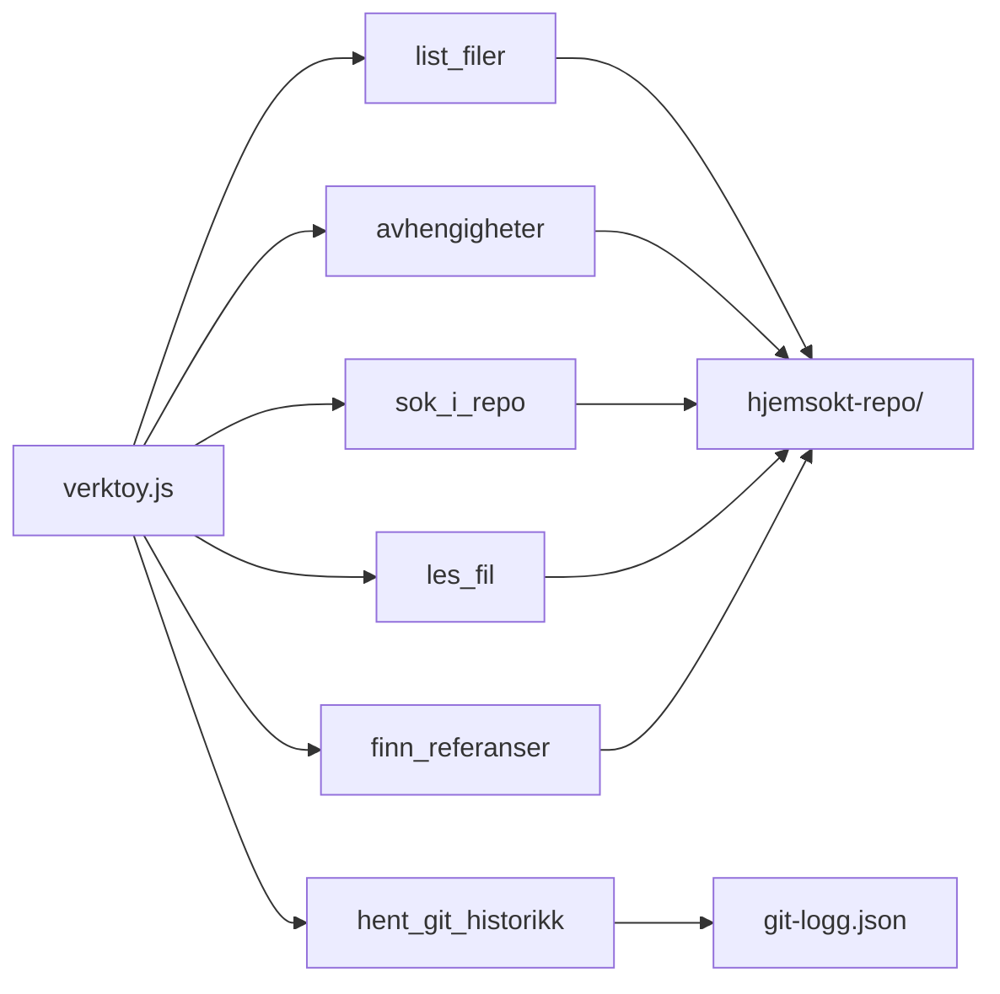
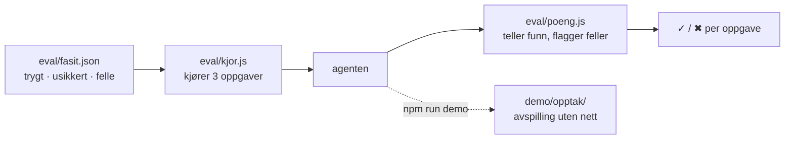

# Arkitektur

```mermaid
flowchart LR
    bruker["👤 Bruker<br/>npm start / npm run demo"]

    subgraph app["Kodekirkegården"]
        direction TB
        index["index.js<br/>leser oppgaven"]
        agent["agent.js<br/>agentløkka"]
        prompt["Systemprompt<br/>fast svarformat + sjekk av indirekte bruk"]
        verktoy["verktoy.js<br/>6 verktøy"]
    end

    llm["🧠 Claude API<br/>bestemmer neste steg"]

    subgraph data["Data (kun lesing)"]
        repo["hjemsokt-repo/<br/>booking-tjenesten"]
        logg["data/git-logg.json<br/>commit-historikk"]
    end

    ut["📜 Nekrologer<br/>dom · bevis · usikkerhet<br/>+ «Skal IKKE fjernes»"]

    bruker --> index --> agent
    prompt --> agent
    agent <-->|"melding / tool_use"| llm
    agent -->|"kjør verktøy"| verktoy
    verktoy -->|"resultat"| agent
    verktoy --> repo
    verktoy --> logg
    agent --> ut
    ut --> bruker
```

## Verktøyene

```mermaid
flowchart LR
    v["verktoy.js"] --> a["list_filer"]
    v --> b["avhengigheter"]
    v --> c["sok_i_repo"]
    v --> d["les_fil"]
    v --> e["finn_referanser"]
    v --> f["hent_git_historikk"]
    a & b & c & d & e --> repo["hjemsokt-repo/"]
    f --> logg["git-logg.json"]
```

## Kvalitetssikring

```mermaid
flowchart LR
    fasit["eval/fasit.json<br/>trygt · usikkert · felle"] --> kjor["eval/kjor.js<br/>kjører 3 oppgaver"]
    kjor --> agent["agenten"]
    agent --> poeng["eval/poeng.js<br/>teller funn, flagger feller"]
    poeng --> res["✓ / ✖ per oppgave"]
    agent -.->|"npm run demo"| opptak["demo/opptak/<br/>avspilling uten nett"]
```
